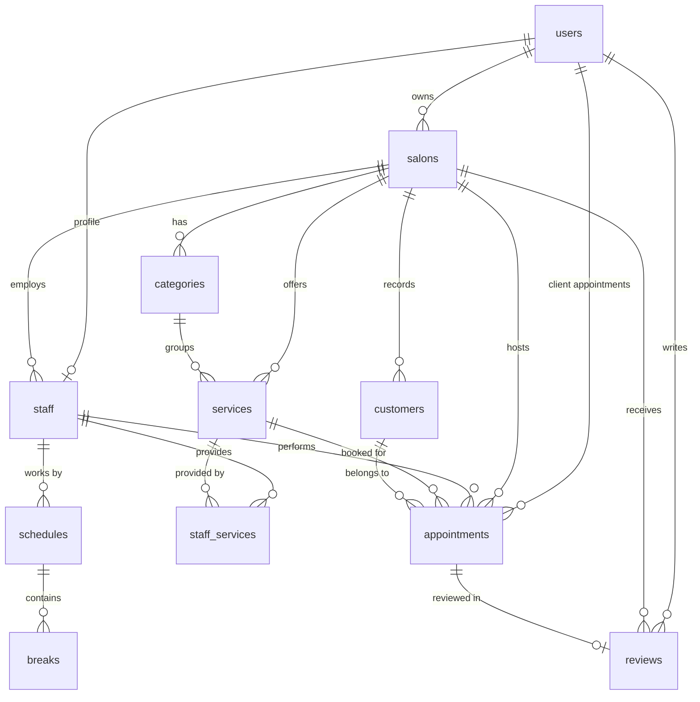

# DIKIDI UZ — Архитектурная документация (ARCHITECTURE.md)

Полное техническое руководство для онбординга нового разработчика или AI-агента. Документ содержит исчерпывающее описание архитектуры, компонентов, схемы данных, протоколов интеграции и операционных процедур.

---

## 1. Краткое описание

**DIKIDI UZ** — мультитенантная цифровая платформа для индустрии красоты и персональных услуг Узбекистана, объединяющая клиентский маркетплейс онлайн-записи и мобильную CRM/ERP-систему для барбершопов, салонов красоты и независимых мастеров. Платформа предоставляет клиентам каталог услуг с бронированием свободных слотов без обязательной регистрации по паролю (вход по OTP через Telegram), а владельцам и мастерам — журнал записей в реальном времени, гибкое управление недельным графиком и перерывами, финансовую аналитику с расчётом комиссионных выплат и CRM-базу клиентов с расчётом LTV.

---

## 2. Технологический стек

| Категория | Технология / Сервис | Версия / Спецификация | Назначение в проекте |
|---|---|---|---|
| **Язык программирования** | TypeScript | `^5.4.0` | Строгая статическая типизация всех пакетов монорепозитория |
| **Среда выполнения** | Node.js | `>=18.18.0` (v20 на сервере) | Runtime для Next.js бэкенда, скриптов миграций и бот-демона |
| **Монорепозиторий** | npm workspaces | Workspaces root | Разделение на `apps/web`, `apps/mobile`, `packages/database` |
| **Веб-фреймворк / API** | Next.js (App Router) | `14.2.35` | SSR веб-витрина салонов (`/b/[slug]`), CRM-дашборд и REST API |
| **Стилизация веба** | Tailwind CSS + Lucide Icons | `^3.4.1`, `lucide-react` | Адаптивный UI клиентского виджета и веб-дашборда |
| **Мобильное приложение** | React Native / Expo | Expo SDK 51 / React Native `0.74.5` | Кроссплатформенное приложение (iOS / Android) с двумя режимами |
| **Мобильный UI / Иконки** | Lucide React Native + Haptics | `lucide-react-native`, `expo-haptics` | Нативный мобильный UI с тактильным откликом |
| **База данных** | PostgreSQL (Supabase) | PostgreSQL 15+ (`schema=dikidi`) | Реляционная БД с изоляцией таблиц в отдельной схеме `dikidi` |
| **ORM / Схема данных** | Prisma ORM | `^5.22.0` | Типобезопасный доступ к данным, миграции и генерация клиента |
| **Auth / Хранилище сессий** | Supabase Auth + HttpOnly Cookies / AsyncStorage | `@supabase/ssr`, `@react-native-async-storage` | Сессии веба через cookie, сессии мобильного через local storage |
| **Telegram Bot API** | Telegram HTTPS API | Direct Fetch (Bot API v7+) | Long-polling демон (`scripts/bot-daemon.cjs`) + OTP доставка |
| **Хостинг / Сервер** | OVH Dedicated VPS | Ubuntu 22.04 LTS (57.128.208.186) | Хостинг веб-сервера, Nginx и Telegram-демона |
| **Reverse Proxy** | Nginx | `1.28.3` | Проксирование внешнего порта 80 на внутренний порт 3000 |
| **Process Manager** | PM2 | `5.4.3` | Управление процессами `dikidi-web` и `dikidi-bot`, авторестарт |
| **Внешний SMS-шлюз** | Eskiz.uz API (зарезервирован) | REST API `notify.eskiz.uz` | Резервный канал доставки SMS (основной канал — Telegram) |

---

## 3. Файловая структура

```
.
├── ecosystem.config.cjs                         # Конфигурация PM2 для запуска dikidi-web и dikidi-bot
├── package.json                                 # Корневой package.json монорепозитория (workspaces)
├── README.md                                    # Общее описание репозитория
├── tsconfig.json                                # Базовые настройки TypeScript для корня
├── scripts/
│   └── bot-daemon.cjs                           # Автономный long-polling демон Telegram-бота (OTP и контакты)
├── packages/
│   └── database/                                # Общий пакет работы с базой данных
│       ├── package.json                         # Конфигурация пакета @dikidi/database
│       ├── tsconfig.json                        # TypeScript конфигурация для prisma-клиента
│       ├── prisma/
│       │   └── schema.prisma                    # Единая схема данных PostgreSQL (Prisma)
│       └── src/
│           ├── index.ts                         # Экспорт инстанса PrismaClient и констант перечислений
│           └── seed.ts                          # Скрипт наполнения тестовыми данными (салоны, мастера, услуги)
├── apps/
│   ├── web/                                     # Next.js 14 приложение (API, Веб-виджет, Дашборд)
│   │   ├── next.config.mjs                      # Конфиг сборщика Next.js
│   │   ├── package.json                         # Зависимости web-приложения (@dikidi/web)
│   │   ├── postcss.config.js                    # Конфигурация PostCSS для Tailwind
│   │   ├── tailwind.config.js                   # Конфигурация темы и путей Tailwind CSS
│   │   ├── tsconfig.json                        # TypeScript конфиг Next.js проекта
│   │   └── src/
│   │       ├── middleware.ts                    # Глобальный middleware Next.js для проверки сессий Supabase
│   │       ├── lib/
│   │       │   ├── telegram.ts                  # Хелперы отправки сообщений, OTP и уведомлений в Telegram
│   │       │   └── utils.ts                     # Утилиты дат по UTC+5 (Ташкент), форматирование UZS и телефонов
│   │       ├── utils/
│   │       │   └── supabase/
│   │       │       ├── client.ts                # Инициализация клиентского браузерного Supabase Client
│   │       │       ├── server.ts                # Инициализация серверного Supabase Client с чтением cookies
│   │       │       └── middleware.ts            # Обновление и валидация auth-токенов в middleware
│   │       └── app/
│   │           ├── layout.tsx                   # Корневой HTML-шаблон веба
│   │           ├── page.tsx                     # Главная страница маркетплейса (каталог салонов)
│   │           ├── globals.css                  # Глобальные стили Tailwind
│   │           ├── login/page.tsx               # Страница веб-входа для владельцев и клиентов
│   │           ├── business/page.tsx            # Лендинг для подключения бизнеса с формой заявки
│   │           ├── dashboard/page.tsx           # Веб-CRM панель управления записями салона
│   │           ├── b/[slug]/page.tsx            # Публичный веб-виджет онлайн-записи конкретного салона
│   │           └── api/
│   │               ├── appointments/route.ts    # REST: создание, выборка и смена статусов записей
│   │               ├── bookings/route.ts        # REST: публичное бронирование через виджет с защитой от овербукинга
│   │               ├── customers/route.ts       # REST: получение списка клиентов CRM салона
│   │               ├── business/apply/route.ts  # REST: прием заявок от новых салонов
│   │               ├── auth/
│   │               │   ├── send-code/route.ts   # REST: генерация 5-значного OTP и отправка в Telegram/SMS
│   │               │   ├── verify-code/route.ts # REST: верификация OTP-кода и выдача cookie-сессии
│   │               │   └── business-login/route.ts # REST: вход для верифицированного бизнеса по логину/паролю
│   │               ├── salons/
│   │               │   ├── route.ts             # REST: список всех салонов (GET) и создание нового (POST)
│   │               │   └── [slug]/
│   │               │       ├── route.ts         # REST: детальная информация о салоне по slug
│   │               │       ├── services/route.ts# REST: добавление новой услуги в прайс салона
│   │               │       ├── staff/route.ts   # REST: добавление нового мастера в штат салона
│   │               │       └── slots/route.ts   # REST: умный расчёт доступных временных слотов
│   │               ├── staff/
│   │               │   └── [staffId]/
│   │               │       └── schedule/route.ts# REST: получение (GET) и сохранение (PUT) расписания мастера
│   │               └── telegram/
│   │                   └── webhook/route.ts     # Резервный HTTP-эндпоинт вебхука Telegram
│   └── mobile/                                  # Expo / React Native мобильное приложение
│       ├── App.tsx                              # Корневой компонент: проверка сессии, переключение режимов, табы
│       ├── app.json                             # Конфигурация Expo проекта (название, slug, splash, permissions)
│       ├── index.js                             # Точка входа React Native (регистрация Root Component)
│       ├── metro.config.js                      # Конфигурация бандлера Metro для поддержки monorepo symlinks
│       ├── package.json                         # Зависимости мобильного приложения
│       ├── tsconfig.json                        # TypeScript конфигурация для мобильного проекта
│       └── src/
│           ├── types.ts                         # Интерфейсы данных (Salon, Staff, Service, Appointment, User)
│           ├── config.ts                        # Базовый URL API (`http://57.128.208.186`), таймауты, форматирование
│           ├── services/
│           │   ├── api.ts                       # HTTP-клиент мобильного приложения со всеми методами API
│           │   └── auth.ts                      # Локальное хранилище сессии пользователя (AsyncStorage)
│           ├── components/
│           │   ├── TabBar.tsx                   # Нижняя навигационная панель с раздельными вкладками (клиент/бизнес)
│           │   ├── StatusBadge.tsx              # Бейдж статуса записи (Ожидает, Подтвержден, Завершен, Отменен)
│           │   ├── ClientBookingModal.tsx       # Пошаговое модальное окно бронирования (Мастер → Дата → Слот → Клиент)
│           │   ├── ManageScheduleModal.tsx      # Модальное окно настройки расписания мастера (дни, часы, обед)
│           │   ├── ManageStaffModal.tsx         # Модальное окно добавления/редактирования мастера салона
│           │   ├── ManageServiceModal.tsx       # Модальное окно создания/редактирования услуги
│           │   ├── CreateSalonModal.tsx         # Полноэкранный визард создания первого салона
│           │   └── AppointmentDetailsModal.tsx  # Детальный просмотр записи в журнале с управлением статусом
│           └── screens/
│               ├── LoginScreen.tsx              # Стартовый экран авторизации: ввод телефона, таймер, ввод 5-значного OTP
│               ├── BusinessAuthModal.tsx        # Модалка входа для бизнеса по логину/паролю и подачи видео-заявки
│               ├── JournalScreen.tsx            # Журнал записей бизнеса: календарная сетка, фильтр по мастерам
│               ├── ClientsScreen.tsx            # Список клиентов салона с историей визитов и суммой покупок
│               ├── FinanceScreen.tsx            # Финансовая сводка: выручка за день/месяц, зарплаты мастеров
│               ├── ProfileScreen.tsx            # Профиль бизнеса: прайс-лист, мастера, график мастера, ссылка /b/[slug]
│               ├── ClientCatalogScreen.tsx      # Каталог салонов для клиентов с поиском и фильтром по категориям
│               ├── ClientAppointmentsScreen.tsx # Экран «Мои записи» клиента с возможностью отмены
│               └── ClientProfileScreen.tsx      # Профиль клиента: имя, телефон, настройки, выход
└── docs/
    └── ARCHITECTURE.md                          # Данный документ архитектуры
```

---

## 4. Переменные окружения

Все переменные окружения задаются в корневом файле `.env` на сервере VPS и дублируются в `packages/database/.env` для Prisma CLI.

| Переменная | Обязательна | Где используется | Описание назначения |
|---|---|---|---|
| `DATABASE_URL` | **Да** | Next.js API, Prisma, Бот-демон | Строка подключения PostgreSQL к Supabase с параметром `?schema=dikidi` |
| `JWT_SECRET` | **Да** | Next.js API, Auth | Секретный ключ для подписи внутренних JWT-токенов сессий |
| `PORT` | Нет (def: 3000) | Next.js server | Порт, на котором запускается Node.js веб-сервис |
| `TELEGRAM_BOT_TOKEN` | **Да** | `telegram.ts`, `bot-daemon.cjs` | Токен Telegram-бота из BotFather для отправки OTP и уведомлений |
| `TELEGRAM_BOT_USERNAME` | **Да** | Web UI, Mobile UI, Bot | Юзернейм бота без `@` (например: `q823374iawsdhfdiowue_bot`) |
| `NEXT_PUBLIC_TELEGRAM_BOT_USERNAME` | **Да** | Клиентский бандл Next.js | Публичный юзернейм бота для генерации прямых ссылок `t.me/...` |
| `NEXT_PUBLIC_SUPABASE_URL` | **Да** | Supabase клиент (веб/сервер) | Публичный URL инстанса Supabase (`https://<project-ref>.supabase.co`) |
| `NEXT_PUBLIC_SUPABASE_PUBLISHABLE_KEY` | **Да** | Supabase клиент (веб/сервер) | Анонимный публичный ключ Supabase (`anon` / `publishable`) |
| `SUPABASE_SERVICE_ROLE_KEY` | Нет | Бэкенд-скрипты миграций | Сервисный ключ Supabase для административных операций в обход RLS |
| `ESKIZ_EMAIL` | Нет | SMS шлюз | Email аккаунта сервиса Eskiz.uz для авторизации SMS-шлюза |
| `ESKIZ_PASSWORD` | Нет | SMS шлюз | Пароль аккаунта Eskiz.uz для получения bearer-токена |
| `NODE_ENV` | Нет (def: dev) | Next.js, PM2 | Окружение: `production` или `development` |

---

## 5. Модули и функции

### 5.1. Пакет базы данных (`packages/database`)

#### `packages/database/src/index.ts`
* **Назначение**: Экземпляр PrismaClient в единственном числе (Singleton) во избежание исчерпания пула соединений в режиме Next.js Hot Reload. Экспорт перечислений.
* **Входы/Выходы**: Экспортирует константу `prisma: PrismaClient`, а также enum-константы `BookingStatus`, `BookingSource`, `PaymentStatus`.
* **Нетривиальная логика**: Использование глобального объекта `globalThis.prisma` в dev-режиме предотвращает создание сотен открытых TCP-сокетов к PostgreSQL при пересборках страниц.

---

### 5.2. Серверный слой (`apps/web/src/app/api`)

#### 1. Авторизация и OTP: `apps/web/src/app/api/auth/send-code/route.ts`
* **Назначение**: Генерация 5-значного OTP-кода для подтверждения номера телефона при входе.
* **Алгоритм**:
  1. Извлекает номер телефона, производит очистку до цифр и знака `+`.
  2. Формирует варианты `cleanedPhone` (`+998...`) и `phoneWithoutPlus` (`998...`).
  3. Ищет пользователя (`prisma.user`) или клиента (`prisma.customer`) по условию `phone: { in: [cleanedPhone, phoneWithoutPlus] }` и проверяет наличие заполненного `telegramChatId`.
  4. Генерирует случайное 5-значное число: `Math.floor(10000 + Math.random() * 90000).toString()`.
  5. Инвалидирует (удаляет) старые неиспользованные коды для этого номера в `prisma.verificationCode`.
  6. Сохраняет новый код со временем жизни 10 минут (`expiresAt`).
  7. Если `telegramChatId` найден — отправляет код через Telegram Bot API (`sendTelegramOtp`). Если нет — логирует отправку через SMS (fallback).
* **Входы**: JSON `{ phone: string }`.
* **Выходы**: JSON `{ success: true, channel: "TELEGRAM" | "SMS", message: string, devCode?: string }`.

#### 2. Проверка кода: `apps/web/src/app/api/auth/verify-code/route.ts`
* **Назначение**: Валидация введённого OTP-кода и создание/возврат пользователя.
* **Алгоритм**:
  1. Нормализует номер телефона с `+` и без него.
  2. Ищет активный код: `phone in [...]`, `code === inputCode`, `isUsed: false`, `expiresAt > now`. При несовпадении возвращает `400 Bad Request`.
  3. Помечает код как `isUsed: true`.
  4. Ищет существующего пользователя `prisma.user` с включением связанных салонов (`ownedSalons`) и профиля мастера (`staffProfile.salon`).
  5. Если пользователь отсутствует — создаёт нового с переданным `role` (по умолчанию `CLIENT`) и именем.
  6. Устанавливает cookie сессии `dikidi_user_id` и `dikidi_user_phone` (срок: 30 дней, `sameSite: "lax"`).
* **Входы**: JSON `{ phone: string, code: string, role?: string, fullName?: string }`.
* **Выходы**: JSON `{ success: true, user: User, message: string }`.

#### 3. Вход для верифицированного бизнеса: `apps/web/src/app/api/auth/business-login/route.ts`
* **Назначение**: Быстрый авторизованный вход владельцев салонов и мастеров по логину и паролю без ожидания OTP.
* **Алгоритм**: Сверяет переданный логин и пароль с базой/хэшем, загружает салон владельца и возвращает данные пользователя.

#### 4. Расчёт доступных слотов: `apps/web/src/app/api/salons/[slug]/slots/route.ts`
* **Назначение**: Расчёт свободных временных окон для онлайн-записи с шагом 30 минут с учётом рабочих графиков, обедов и существующих записей.
* **Алгоритм**:
  1. Загружает салон по `slug`, запрашивает услугу по `serviceId`.
  2. Определяет день недели целевой даты (`0` = воскресенье, `1` = понедельник...).
  3. Находит мастеров, оказывающих данную услугу (`staffServices`). Если передан конкретный `staffId !== "any"`, оставляет только его.
  4. Запрашивает диапазон суток по ташкентскому времени (UTC+5) через `getTashkentDayRange(dateStr)` и выбирает все незавершённые/неотменённые записи (`status != CANCELLED`).
  5. Для каждого мастера парсит расписание на этот день: проверяет `isDayOff`. Если рабочий день — переводит рабочие часы (`startTime`, `endTime`) в минуты от полуночи (`workStartMinutes`, `workEndMinutes`).
  6. Формирует интервалы перерывов мастера (`schedule.breaks`) в минутах.
  7. Формирует интервалы существующих записей мастера в минутах (`start`, `end`).
  8. Проходит циклом от `workStartMinutes` до `workEndMinutes - durationMinutes` с шагом 30 минут:
     - Проверяет пересечение `[slotStart, slotEnd]` с обеденными перерывами: `slotStart < b.end && slotEnd > b.start`.
     - Проверяет пересечение с существующими записями: `slotStart < a.end && slotEnd > a.start`.
     - Если пересечений нет, добавляет `master.id` в список доступных мастеров для времени `HH:MM`.
  9. Сортирует слоты по возрастанию времени и возвращает массив.
* **Входы**: Query-параметры `date` (YYYY-MM-DD), `serviceId`, `staffId` (опционально, `"any"` по умолчанию).
* **Выходы**: JSON `{ slots: Array<{ time: string, availableStaffIds: string[] }> }`.

#### 5. Создание бронирования: `apps/web/src/app/api/bookings/route.ts`
* **Назначение**: Создание брони через онлайн-виджет с гарантией защиты от овербукинга и Telegram-уведомлением.
* **Алгоритм**:
  1. Валидирует обязательные поля: `salonSlug`, `serviceId`, `staffId`, `date`, `time`, `clientName`, `clientPhone`.
  2. Вычисляет `startDateTime = parseTashkentDateTime(date, time)` (строго `+05:00`) и `endDateTime = startDateTime + durationMinutes`.
  3. **Overbooking Check**: Выполняет атомарный поиск конфликтных записей мастера:
     `(startDateTime <= a.start && endDateTime > a.start) || (startDateTime < a.end && endDateTime >= a.end) || (startDateTime >= a.start && endDateTime <= a.end)`. Если найдена — возвращает статус `409 Conflict`.
  4. Создает или обновляет клиента `prisma.customer`: увеличивает `totalVisits`, прибавляет `service.price` к `totalSpent`, обновляет `telegramChatId`.
  5. Создает запись `prisma.appointment` со статусом `PENDING`.
  6. Если у клиента есть `telegramChatId`, асинхронно вызывает `sendTelegramBookingNotice` с форматированными деталями визита.
* **Входы**: JSON с параметрами бронирования.
* **Выходы**: JSON `{ success: true, appointment: Appointment, message: string }`.

#### 6. График мастера: `apps/web/src/app/api/staff/[staffId]/schedule/route.ts`
* **Назначение**: Получение (`GET`) и сохранение (`PUT`) индивидуального недельного расписания мастера и перерывов.
* **Алгоритм PUT**:
  1. Принимает массив из 7 элементов расписания (понедельник–воскресенье).
  2. В транзакции для каждого дня выполняет `upsert` в таблицу `schedules` по составному ключу `[staffId, dayOfWeek]`.
  3. Удаляет старые перерывы `prisma.break.deleteMany({ where: { scheduleId } })` и записывает новый обеденный интервал (`breakStart` — `breakEnd`).
* **Входы**: `PUT` с телом `{ schedules: ScheduleItem[] }`.
* **Выходы**: JSON `{ success: true, message: "График успешно сохранен" }`.

#### 7. Салоны, Услуги, Мастера:
* `apps/web/src/app/api/salons/route.ts`:
  * `GET`: возвращает список всех верифицированных салонов с включением услуг, мастеров и категорий.
  * `POST`: создание нового салона владельцем, генерация уникального URL-слага (`slug`), привязка `ownerId`.
* `apps/web/src/app/api/salons/[slug]/services/route.ts`: добавление услуги в прайс салона.
* `apps/web/src/app/api/salons/[slug]/staff/route.ts`: добавление мастера в штат салона.
* `apps/web/src/app/api/appointments/route.ts`:
  * `GET`: выборка записей для CRM-журнала на заданную дату с фильтрацией по мастеру.
  * `PATCH`: смена статуса записи (`PENDING` → `CONFIRMED` → `COMPLETED` → `CANCELLED`) и статуса оплаты (`UNPAID` → `PAID`).

---

### 5.3. Мобильное приложение (`apps/mobile`)

#### 1. Корневой диспетчер: `apps/mobile/App.tsx`
* **Назначение**: Проверка сессии при холодном старте, хранение текущего пользователя (`currentUser`) и выбранного салона (`currentSalon`), переключение режимов:
  * Режим `client` (каталог, мои бронирования, профиль клиента).
  * Режим `business` (журнал, клиенты, финансы, салон).
* **Нетривиальная логика**: Если пользователь не авторизован, приложение не пускает дальше `LoginScreen`. При выходе (`handleLogout`) полностью очищает `authStorage` и возвращает пользователя на форму входа.

#### 2. Вход и регистрация: `apps/mobile/src/screens/LoginScreen.tsx`
* **Назначение**: Авторизация по номеру телефона и 5-значному OTP-коду.
* **Особенности**:
  * Маска ввода телефона `+998 XX XXX XX XX`.
  * Таймер повторной отправки кода (60 секунд).
  * Отображение подсказки с переходом в Telegram-бота `@q823374iawsdhfdiowue_bot`.
  * Если пользователь новый (нет имени или имя `"Пользователь"`), переводит на шаг `register` для ввода ФИО и пола перед входом в систему.

#### 3. Журнал записей: `apps/mobile/src/screens/JournalScreen.tsx`
* **Назначение**: Интерактивная шахматка/список записей салона на выбранный день.
* **Особенности**:
  * Горизонтальный скролл календаря с быстрыми кнопками («Сегодня», «Завтра» и дни недели).
  * Фильтр по мастерам в шапке (чипы с именами мастеров).
  * Карточки записей с цветными бейджами статусов (`StatusBadge`).
  * Обработка пустого состояния: при 0 записей отображает чистую заглушку с кнопкой «Добавить запись», без зависания индикатора загрузки.
  * Открытие модалки деталей записи (`AppointmentDetailsModal`) для смены статуса (Завершить / Отменить / Подтвердить).

#### 4. Профиль салона и график: `apps/mobile/src/screens/ProfileScreen.tsx`
* **Назначение**: Управление карточкой салона, ссылкой онлайн-записи, штатом мастеров, услугами и расписанием.
* **Особенности**:
  * Если салон ещё не создан (новый пользователь), показывает экран `CreateSalonModal`.
  * Генерация и шаринг ссылки онлайн-записи `http://57.128.208.186/b/[slug]`.
  * Блок **«Мой рабочий график»**: отображается для текущего мастера (или владельца с профилем мастера) и открывает `ManageScheduleModal`.
  * Кнопка **«График»** на карточке каждого мастера в списке штата.

#### 5. Модалка графика мастера: `apps/mobile/src/components/ManageScheduleModal.tsx`
* **Назначение**: Детальная настройка расписания мастера по 7 дням недели.
* **Особенности**:
  * Переключатели (Switch) «Работает» / «Выходной» для каждого дня.
  * Поля ввода начала и окончания смены (`HH:MM`).
  * Поля ввода обеденного перерыва (`breakStart` — `breakEnd`).
  * Сохранение через вызов API `PUT /api/staff/[staffId]/schedule`.

#### 6. Клиентский каталог и бронирование: `apps/mobile/src/screens/ClientCatalogScreen.tsx` и `ClientBookingModal.tsx`
* **Назначение**: Поиск салонов по категориям («Барбершопы», «Маникюр», «Косметология») и пошаговый процесс онлайн-записи:
  * Шаг 1: Выбор услуги из прайса салона.
  * Шаг 2: Выбор мастера («Любой свободный» или конкретный специалист).
  * Шаг 3: Выбор даты и динамический запрос доступных слотов через API `slots`.
  * Шаг 4: Подтверждение записи с вводом комментария.

---

### 5.4. Демон Telegram-бота (`scripts/bot-daemon.cjs`)
* **Назначение**: Автономный процесс Node.js, обеспечивающий двустороннюю связь между Telegram-пользователями и базой данных Supabase без необходимости входящих вебхуков и SSL-сертификатов.
* **Алгоритм**:
  1. При запуске вызывает метод Telegram Bot API `deleteWebhook?drop_pending_updates=false`, переводя бота в режим polling.
  2. Запускает бесконечный цикл `getUpdates?offset=${offset}&timeout=25` (long-polling с таймаутом 25 сек).
  3. При получении команды `/start`: приветствует пользователя и отправляет Reply Keyboard с кнопкой `request_contact: true` («📱 Поделиться номером телефона»).
  4. При получении события контакта (`contact.phone_number`):
     - Нормализует номер (добавляет `+` если отсутствует).
     - Выполняет поиск пользователя в базе: `phone: { in: [cleaned, withoutPlus] }`.
     - Если найден — обновляет `telegramId`, `telegramChatId`, `telegramUsername`.
     - Если не найден — создаёт базового пользователя роли `CLIENT`.
     - Обновляет все записи клиента в CRM салонов (`prisma.customer`).
     - Отправляет пользователю подтверждающее сообщение о привязке аккаунта и удаляет кнопку клавиатуры.
* **Отказоустойчивость**: Ошибки сетевого таймаута или сбои Telegram API перехватываются через `try/catch` с экспоненциальной паузой 4 секунды, предотвращая падение процесса.

---

## 6. Схема базы данных (PostgreSQL / Prisma)

Все таблицы размещаются в схеме `dikidi` базы данных Supabase PostgreSQL.



### Детальная спецификация таблиц

#### 1. Таблица `users` (Системные пользователи)
| Поле | Тип | Модификаторы | Описание |
|---|---|---|---|
| `id` | `TEXT` (UUID) | `@id`, `default(uuid())` | Первичный ключ |
| `phone` | `TEXT` | `@unique` | Номер телефона в формате `+998XXXXXXXXX` |
| `fullName` | `TEXT` | `NOT NULL` | Полное имя пользователя |
| `email` | `TEXT` | `NULL` | Опциональный email |
| `role` | `TEXT` | `default("MASTER")` | Роль: `OWNER`, `ADMIN`, `MASTER`, `CLIENT` |
| `avatarUrl` | `TEXT` | `NULL` | Ссылка на аватар пользователя |
| `telegramId` | `TEXT` | `@unique`, `NULL` | Числовой ID пользователя в Telegram (as string) |
| `telegramChatId` | `TEXT` | `NULL` | ID личного чата с ботом для отправки сообщений |
| `telegramUsername`| `TEXT`| `NULL` | Юзернейм пользователя в Telegram (без `@`) |
| `createdAt` | `TIMESTAMP` | `default(now())` | Дата создания записи |
| `updatedAt` | `TIMESTAMP` | `@updatedAt` | Дата последнего обновления |

#### 2. Таблица `salons` (Салоны красоты и барбершопы)
| Поле | Тип | Модификаторы | Описание |
|---|---|---|---|
| `id` | `TEXT` (UUID) | `@id`, `default(uuid())` | Первичный ключ |
| `ownerId` | `TEXT` | `FK -> users.id`, `onDelete: Cascade` | Владелец бизнеса |
| `name` | `TEXT` | `NOT NULL` | Название салона |
| `slug` | `TEXT` | `@unique` | URL-идентификатор для онлайн-записи (например: `chop-chop`) |
| `phone` | `TEXT` | `NOT NULL` | Контактный телефон салона |
| `city` | `TEXT` | `default("Ташкент")` | Город расположения |
| `address` | `TEXT` | `NOT NULL` | Физический адрес |
| `landmark` | `TEXT` | `NULL` | Ориентир |
| `latitude` / `longitude` | `FLOAT` | `NULL` | Географические координаты |
| `rating` | `FLOAT` | `default(5.0)` | Средний рейтинг |
| `reviewCount` | `INT` | `default(0)` | Количество отзывов |
| `isVerified` | `BOOLEAN` | `default(true)` | Флаг подтверждения бизнеса администрацией |

#### 3. Таблица `staff` (Сотрудники и мастера)
| Поле | Тип | Модификаторы | Описание |
|---|---|---|---|
| `id` | `TEXT` (UUID) | `@id`, `default(uuid())` | Первичный ключ мастера |
| `salonId` | `TEXT` | `FK -> salons.id`, `onDelete: Cascade` | Привязка к салону |
| `userId` | `TEXT` | `@unique`, `FK -> users.id`, `NULL` | Привязка к аккаунту для входа |
| `fullName` | `TEXT` | `NOT NULL` | Имя мастера |
| `specialty` | `TEXT` | `NOT NULL` | Специализация / Должность (Барбер, Колорист и т.д.) |
| `phone` | `TEXT` | `NULL` | Личный номер мастера |
| `commissionPercent` | `INT` | `default(40)` | Процент от стоимости услуги, идущий в зарплату |
| `isActive` | `BOOLEAN` | `default(true)` | Статус активности (уволен / в отпуске) |

#### 4. Таблица `services` (Услуги салона)
| Поле | Тип | Модификаторы | Описание |
|---|---|---|---|
| `id` | `TEXT` (UUID) | `@id`, `default(uuid())` | Первичный ключ услуги |
| `salonId` | `TEXT` | `FK -> salons.id`, `onDelete: Cascade` | Салон |
| `categoryId` | `TEXT` | `FK -> categories.id`, `NULL` | Категория услуги |
| `nameRu` | `TEXT` | `NOT NULL` | Название услуги на русском языке |
| `nameUz` | `TEXT` | `NULL` | Название услуги на узбекском языке |
| `durationMinutes` | `INT` | `default(45)` | Длительность выполнения в минутах |
| `price` | `INT` | `NOT NULL` | Стоимость услуги в сумах (UZS) |
| `isActive` | `BOOLEAN` | `default(true)` | Доступность для онлайн-записи |

#### 5. Таблица `staff_services` (Матрица квалификации)
* Составной первичный ключ: `@@id([staffId, serviceId])`.
* Связывает мастеров с услугами, которые они имеют право выполнять.

#### 6. Таблицы `schedules` и `breaks` (Рабочий график)
* `schedules`:
  * `id`: UUID.
  * `staffId`: FK на мастера.
  * `dayOfWeek`: целое число от `0` (воскресенье) до `6` (суббота).
  * `startTime` / `endTime`: строковое время в формате `HH:MM` (например: `"09:00"`, `"19:00"`).
  * `isDayOff`: логический флаг выходного дня.
  * Уникальный индекс: `@@unique([staffId, dayOfWeek])`.
* `breaks`:
  * `id`: UUID.
  * `scheduleId`: FK на расписание дня (`onDelete: Cascade`).
  * `startTime` / `endTime`: интервал перерыва (например: `"13:00"` — `"14:00"`).
  * `title`: назначение перерыва (по умолчанию `"Обед"`).

#### 7. Таблица `customers` (База клиентов CRM)
| Поле | Тип | Модификаторы | Описание |
|---|---|---|---|
| `id` | `TEXT` (UUID) | `@id`, `default(uuid())` | Первичный ключ клиента |
| `salonId` | `TEXT` | `FK -> salons.id`, `onDelete: Cascade` | Салон, к которому привязан клиент |
| `phone` | `TEXT` | `NOT NULL` | Номер телефона клиента |
| `fullName` | `TEXT` | `NOT NULL` | Имя клиента |
| `totalVisits` | `INT` | `default(0)` | Число завершённых визитов |
| `totalSpent` | `INT` | `default(0)` | Общая сумма покупок в UZS (LTV) |
| `telegramChatId` | `TEXT` | `NULL` | Чат Telegram для отправки напоминаний |
| Составной уникальный индекс: `@@unique([salonId, phone])`.

#### 8. Таблица `appointments` (Записи / Бронирования)
| Поле | Тип | Модификаторы | Описание |
|---|---|---|---|
| `id` | `TEXT` (UUID) | `@id`, `default(uuid())` | Первичный ключ записи |
| `salonId` | `TEXT` | `FK -> salons.id` | Салон |
| `staffId` | `TEXT` | `FK -> staff.id` | Назначенный мастер |
| `serviceId` | `TEXT` | `FK -> services.id` | Выбранная услуга |
| `customerId` | `TEXT` | `FK -> customers.id`, `NULL` | Клиент из CRM-базы |
| `clientUserId` | `TEXT` | `FK -> users.id`, `NULL` | Аккаунт клиента (если авторизован) |
| `startDateTime` | `TIMESTAMP` | `NOT NULL` | Точное время начала визита (UTC) |
| `endDateTime` | `TIMESTAMP` | `NOT NULL` | Точное время завершения визита (UTC) |
| `status` | `TEXT` | `default("PENDING")` | `PENDING`, `CONFIRMED`, `IN_PROGRESS`, `COMPLETED`, `CANCELLED` |
| `source` | `TEXT` | `default("ONLINE_WIDGET")` | `ONLINE_WIDGET`, `TELEGRAM_BOT`, `MANUAL_ADMIN` |
| `price` | `INT` | `NOT NULL` | Финальная сумма к оплате в UZS |
| `paymentStatus` | `TEXT` | `default("UNPAID")` | `UNPAID` или `PAID` |
| `paymentMethod` | `TEXT` | `default("CASH")` | `CASH`, `PAYME`, `CLICK`, `TERMINAL` |
| `clientName` / `clientPhone` | `TEXT` | `NOT NULL` | Снимок контактных данных клиента на момент записи |
| Индексы: `@@index([salonId, startDateTime])`, `@@index([staffId, startDateTime])`.

#### 9. Таблица `verification_codes` (OTP-коды)
| Поле | Тип | Модификаторы | Описание |
|---|---|---|---|
| `id` | `TEXT` (UUID) | `@id`, `default(uuid())` | Первичный ключ |
| `phone` | `TEXT` | `NOT NULL` | Номер телефона получателя |
| `code` | `TEXT` | `NOT NULL` | 5-значный числовой код (например: `"74829"`) |
| `channel` | `TEXT` | `default("TELEGRAM")` | Канал отправки: `TELEGRAM` или `SMS` |
| `isUsed` | `BOOLEAN` | `default(false)` | Флаг использования кода |
| `expiresAt` | `TIMESTAMP` | `NOT NULL` | Время истечения срока действия (через 10 минут) |
| Индекс: `@@index([phone, code])`.

---

## 7. Внешние API

### 7.1. Telegram Bot API

* **Базовый URL**: `https://api.telegram.org/bot<TELEGRAM_BOT_TOKEN>/`
* **Авторизация**: Токен бота в URL пути.
* **Используемые методы**:
  1. `POST /sendMessage`:
     * **Тело**: `{ chat_id: string, text: string, parse_mode: "HTML", reply_markup?: object }`.
     * **Применение**: Доставка одноразовых 5-значных OTP-кодов и подтверждений онлайн-бронирования.
  2. `GET /getUpdates`:
     * **Параметры**: `?offset=<number>&timeout=25`.
     * **Применение**: Long-polling демон в `scripts/bot-daemon.cjs` для приёма сообщений пользователей и контактов.
  3. `POST /deleteWebhook`:
     * **Параметры**: `?drop_pending_updates=false`.
     * **Применение**: Очистка вебхука перед стартом long-polling, устранение ошибки `409 Conflict`.
* **Подводные камни и специфика**:
  * **Формат номера телефона в контактах**: Telegram может передавать номер контакта без ведущего знака `+` (например: `998901234567`). Демон нормализует номер добавлением `+` и выполняет поиск по условию `{ in: [cleaned, withoutPlus] }`.
  * **Запрет параллельных механизмов**: Telegram категорически запрещает вызывать `getUpdates`, если на боте зарегистрирован вебхук. Демон всегда принудительно удаляет вебхук при старте.

---

### 7.2. Supabase PostgreSQL & Auth API

* **Базовый URL**: `https://<REF>.supabase.co` и прямое подключение к БД `db.<REF>.supabase.co:5432`.
* **Авторизация**:
  * Direct DB: Пользователь `postgres`, пароль в строке подключения `DATABASE_URL`.
  * HTTP / Storage: Bearer-токен `NEXT_PUBLIC_SUPABASE_PUBLISHABLE_KEY`.
* **Подводные камни и специфика**:
  * **IPv6 адресация**: Хост Supabase `db.<REF>.supabase.co` на бесплатном тарифе резолвится через IPv6 AAAA-запись. Хост VPS должен иметь включённый стек IPv6 (проверено на OVH VPS).
  * **Изоляция схем (Критично)**: В схеме `public` в Supabase по умолчанию создаются системные таблицы Supabase Auth (`auth.users`). При попытке применить `prisma db push` в схему `public` Prisma завершается с ошибкой перекрестных внешних ключей. Решение: подключение строго через схему `dikidi`: `?schema=dikidi`.

---

## 8. Бизнес-логика и пользовательские сценарии

### Сценарий 1: Регистрация и вход пользователя по Telegram OTP
1. Пользователь запускает мобильное приложение. Сессия отсутствует → отображается экран `LoginScreen`.
2. Пользователь вводит номер телефона `+998 (90) 123-45-67` и нажимает кнопку **«Получить код»**.
3. Приложение вызывает `POST /api/auth/send-code`.
4. Бэкенд проверяет наличие привязанного Telegram-чата:
   * **Если бот запущен**: 5-значный код мгновенно отправляется в Telegram от бота `@q823374iawsdhfdiowue_bot`.
   * **Если бот не был запущен**: приложение показывает плашку с инструкцией перейти в бота и нажать кнопку **«Поделиться номером телефона»**.
5. Пользователь вводит полученный код. Приложение вызывает `POST /api/auth/verify-code`.
6. Бэкенд проверяет код в таблице `verification_codes`, помечает его `isUsed = true` и возвращает объект `user`.
7. Если у пользователя есть салон или роль `MASTER`/`SALON_OWNER`, приложение переключается в режим **«Бизнес»** (`JournalScreen`). Если это обычный клиент — в режим **«Клиент»** (`ClientCatalogScreen`).

---

### Сценарий 2: Настройка рабочего графика мастером в мобильном приложении
1. Мастер открывает вкладку **«Салон»** (`ProfileScreen`).
2. Нажимает кнопку **«Настроить»** в карточке **«Мой рабочий график»** (или владелец нажимает «График» у сотрудника).
3. Открывается модальное окно `ManageScheduleModal`:
   * Отображается список 7 дней недели (Понедельник–Воскресенье).
   * Для каждого дня есть тумблер («Работает» / «Отдых»).
   * Для рабочих дней активны поля ввода часов: начало работы (`09:00`), конец работы (`19:00`), а также интервал обеденного перерыва (`13:00` — `14:00`).
4. Мастер вносит изменения и нажимает **«Сохранить расписание»**.
5. Приложение вызывает `PUT /api/staff/[staffId]/schedule`.
6. Сервер атомарно обновляет записи в таблицах `schedules` и `breaks`.
7. При следующем запросе доступных слотов для онлайн-записи новые нерабочие часы и обед автоматически исключаются из выдачи.

---

### Сценарий 3: Клиентское бронирование через публичный веб-виджет
1. Клиент переходит по ссылке салона `http://57.128.208.186/b/salon-name` (из Instagram или Telegram-канала).
2. Выбирает желаемую услугу (например: «Мужская стрижка», 45 мин, 120 000 UZS).
3. Выбирает мастера или нажимает «Любой свободный мастер».
4. Выбирает дату в календаре. Виджет запрашивает эндпоинт `GET /api/salons/[slug]/slots?date=...&serviceId=...`.
5. Сервер вычисляет пересечения рабочего времени мастеров, существующих записей и обедов, отдавая массив свободных слотов (`10:00`, `10:30`, `11:30`...).
6. Клиент нажимает на время `11:30`, вводит имя и телефон и нажимает **«Записаться»**.
7. Сервер выполняет проверку на отсутствие конфликта времени в `prisma.appointment`, сохраняет бронь, обновляет статистику клиента в CRM и отправляет клиенту детализированное подтверждение в Telegram.
8. В мобильном приложении администратора в реальном времени в `JournalScreen` на дату записи появляется карточка с бейджем «Ожидает».

---

## 9. Деплой и инфраструктура

### 9.1. Архитектура размещения

```
[ Интернет: Клиенты, Мастера, Telegram Bot API ]
                      │
                      ▼
           [ Порт 80: Nginx Reverse Proxy ]
                      │
         ┌────────────┴────────────┐
         ▼                         ▼
 [ Порт 3000: Next.js ]   [ scripts/bot-daemon.cjs ]
 (PM2: dikidi-web)        (PM2: dikidi-bot)
         │                         │
         └────────────┬────────────┘
                      ▼
        [ Supabase PostgreSQL: 5432 ]
        (Схема: dikidi, IPv6 Direct)
```

### 9.2. Параметры сервера (Production)
* **IP-адрес хоста**: `57.128.208.186`
* **Пользователь**: `ubuntu`
* **SSH-ключ доступа**: `~/.ssh/cupid_vps`
* **Путь к репозиторию**: `/home/ubuntu/dikidi`
* **Конфигурация Nginx**: `/etc/nginx/sites-available/default` (прокси на `http://localhost:3000`)
* **Логи сервисов**:
  * Веб-приложение: `/home/ubuntu/dikidi/logs/app.log`
  * Бот-демон: `/home/ubuntu/dikidi/logs/bot.log`
  * PM2 системные логи: `~/.pm2/logs/`

### 9.3. Пошаговая процедура обновления кода (Deploy Workflow)

Для обновления продакшн-окружения на VPS выполняется следующая последовательность команд:

```bash
# 1. Подключение к серверу и переход в директорию
ssh -i ~/.ssh/cupid_vps ubuntu@57.128.208.186
cd /home/ubuntu/dikidi

# 2. Получение свежего кода из ветки main
git checkout -- .
git pull origin main

# 3. Синхронизация зависимостей и генерация Prisma-клиента
npm install
npx prisma generate --schema=packages/database/prisma/schema.prisma

# 4. Продакшн-сборка веб-приложения Next.js
npm run build --workspace=@dikidi/web

# 5. Перезапуск процессов в PM2
pm2 restart ecosystem.config.cjs --update-env
pm2 save
```

---

## 10. Известные проблемы, ограничения и техдолг

1. **IPv6 резолвинг Supabase**:
   * *Проблема*: Серверы базы данных Supabase на бесплатном плане имеют только IPv6 адреса.
   * *Ограничение*: Локальная разработка без поддержки IPv6 у интернет-провайдера может завершаться ошибкой `getaddrinfo ENOTFOUND`.
   * *Решение*: Использовать мобильную точку доступа с поддержкой IPv6 или запускать запросы к базе через сервер VPS.

2. **Supabase Schema Introspection**:
   * *Проблема*: Нельзя запускать `prisma db push` без параметра `?schema=dikidi`. Если схема не указана, Prisma пытается синхронизировать схему `public`, где находятся системные таблицы Supabase с внешними ключами к недоступной схеме `auth`.

3. **Cyrillic Font Kerning в React Native**:
   * *Проблема*: Использование свойства `letterSpacing: 2` (или выше) в React Native на некоторых версиях Android и iOS вызывает неестественные разрывы и пробелы после каждого символа в кириллических текстах.
   * *Решение*: В мобильном приложении свойство `letterSpacing` полностью исключено из всех текстовых стилей.

4. **Зависание индикатора загрузки при пустых списках**:
   * *Проблема*: Ранний возврат `if (!salon) return;` в React-хуках до вызова `setLoading(false)` приводил к вечному спиннеру загрузки в журналах и клиентах.
   * *Решение*: Состояние `loading` всегда должно сниматься в блоке `finally` вне зависимости от наличия данных в базе.

---

## 11. Важные правила разработки (Rules & Invariants)

> [!CAUTION]
> **Категорически запрещено:**
> 1. Менять целевую схему БД на `public` в `packages/database/prisma/schema.prisma`. Все таблицы проекта должны оставаться в `?schema=dikidi`.
> 2. Возвращать статические или захардкоженные OTP-коды (типа `12121` или `0000`). Авторизация должна осуществляться исключительно через случайный 5-значный код с сохранением в `verification_codes`.
> 3. Использовать локальное серверное время `new Date()` для расчёта временных слотов и сохранения записей. Все календарные расчёты должны строго выполняться через хелперы `apps/web/src/lib/utils.ts` с явным часовым поясом Ташкента (`UTC+5`, `Asia/Tashkent`).
> 4. Добавлять `letterSpacing` в текстовые стили компонентов `apps/mobile` из-за багов отрисовки кириллицы на мобильных устройствах.
> 5. Включать вебхук на Telegram-боте через `setWebhook`, так как на сервере работает long-polling процесс `dikidi-bot`. Регистрация вебхука приведёт к блокировке получения OTP-кодов.

> [!IMPORTANT]
> **Обязательно учитывать:**
> - Номера телефонов пользователей в базе данных должны всегда сохраняться в международном формате с плюсом: `+998XXXXXXXXX`. Однако все функции поиска пользователей (`findFirst`, `findUnique`) обязаны проверять оба формата: с ведущим плюсом и без него (`{ in: [phoneWithPlus, phoneWithoutPlus] }`), так как сторонние клиенты и Telegram могут опускать символ `+`.
> - Все фоновые службы сервера должны быть зарегистрированы в файле `ecosystem.config.cjs` для гарантированного автозапуска через `systemd` при перезагрузке операционной системы VPS.
